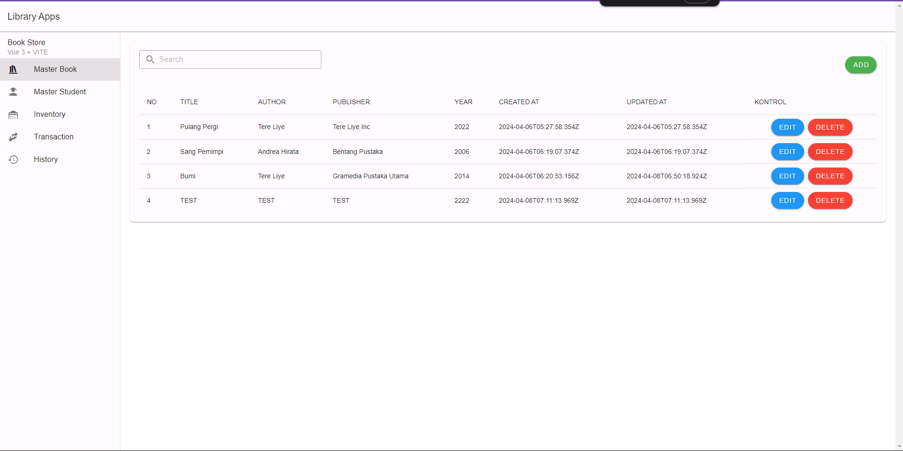
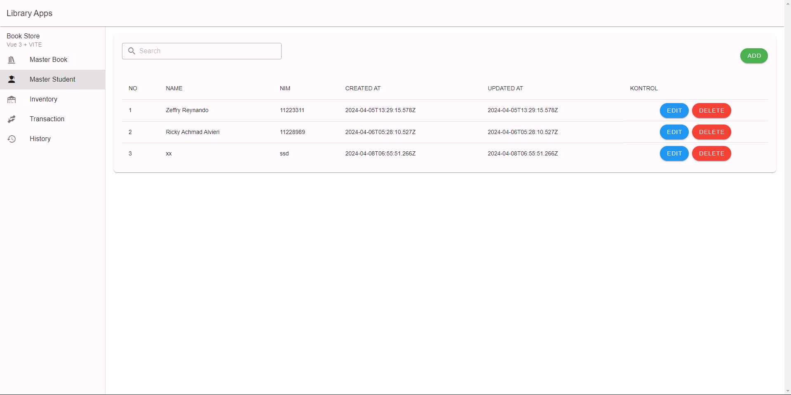
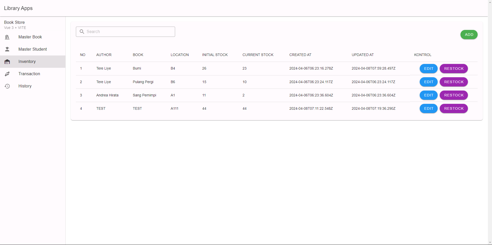
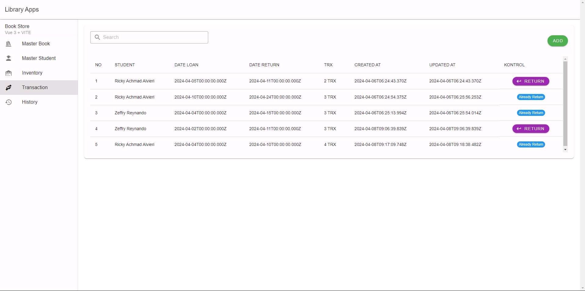
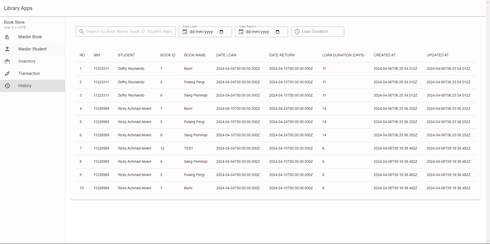

# Frontend for Library Apps

The project builds using Vue 3, Vuetify, Vue Router, Vite, Tailwind CSS

## Manual Installation

```bash
git clone https://github.com/zgramming/book-store-fe-vue-3.git
cd book-store-fe-nextjs
```

Install the dependencies:

```bash
npm install
```

Set the environment variables:

```bash
cp .env.example .env
# open .env and modify the environment variables
```


## Table of Contents

- [Commands](#commands)
- [Environment Variables](#environment-variables)
- [Pages](#pages)

## Commands

Running in development:

```bash
npm run dev
```

Running in production:

```bash
# build
npm run build
# start
npm run preview
```

## Environment Variables

The environment variables can be found and modified in the `.env` file.

```bash
# API Url
VITE_API_URL = http://localhost:4000/api/v1
```

### Pages
List of available pages:

**Master Book**\


**Master Student**\


**Inventory**\


**Transaction**\


**History Transaction**


